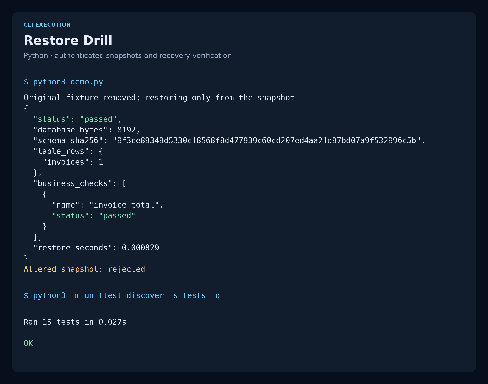

# Restore Drill

A backup only proves recovery when it can be restored and queried. Restore Drill
creates a consistent SQLite snapshot, authenticates its manifest with HMAC-SHA-256,
then restores a copy into an isolated temporary directory and checks database
integrity, schema, row counts and optional business invariants.

## Execution capture



Rendered from actual demo and test output. The [raw transcript](docs/assets/execution.json)
and [capture script](../../../tools/project-screenshots/README.md) make this image reproducible.

## Run the demonstration

Requires Linux and Python 3.11+; no third-party packages or database server.

```bash
python3 -m unittest discover -s tests -v
python3 demo.py
```

The demo backs up a fixture, removes the original fixture, restores from the
snapshot, checks the invoice total, and rejects a snapshot after one byte is
modified. It never touches a production path.

## Back up a database

Run in a directory controlled by the administrator. Generate and retain a key
in your secret manager; the same key is needed to authenticate later rehearsals.

```bash
export RESTORE_SIGNING_KEY="$(python3 -c 'import secrets; print(secrets.token_hex(32))')"
python3 drill.py backup /path/to/application.sqlite ./recovery-bundle
python3 drill.py verify ./recovery-bundle
```

`recovery-bundle` must be a new directory. The tool refuses to overwrite an
existing destination. The SQLite backup API includes committed WAL transactions;
copying only a live `.sqlite` file would not provide that guarantee.

Bundle files are `snapshot.sqlite` and `manifest.json`. Directory permissions are
0700 and file permissions are 0600. Manifest authentication covers the schema
digest, snapshot digest and length, creation timestamp and table row counts.

## Check business recovery

Create a local `checks.json`:

```json
[
  {
    "name": "invoice count",
    "sql": "SELECT COUNT(*) FROM invoices",
    "expected": 2
  }
]
```

```bash
python3 drill.py verify ./recovery-bundle --checks checks.json
```

Each query must return exactly one row and one value matching its expectation.
Checks are administrator-written SELECT queries. An authorizer blocks writes,
database attachment and PRAGMA changes. A SQLite instruction budget interrupts
long-running queries. A failed check or authentication exits with a nonzero
status; success prints a JSON report suitable for a CI artifact.

## Rehearsal sequence

1. Read a bounded regular manifest file without following its symlink.
2. Authenticate the manifest before trusting its digests or file size.
3. Require the fixed snapshot filename and read bounded, non-symlink snapshot bytes.
4. Compare the actual length and SHA-256 with the authenticated manifest.
5. Write those verified bytes into a private temporary directory.
6. Open the restored database read-only, run `PRAGMA integrity_check`, compare
   its schema and row counts, then evaluate the business checks.
7. Remove the rehearsal directory and report the measured local restore duration.

## Validation and limits

Fifteen tests include restoration without the original file, a live WAL database,
tampered files, wrong keys, schema drift, failed business checks, path traversal,
symlinks, size limits and non-destructive destination handling.

This is a local SQLite recovery rehearsal, not a backup scheduler or immutable
off-site storage service. Snapshots are not encrypted. HMAC authenticates using a
shared secret; protect the key separately from the backup. A compromised signing
key or a validly signed stale backup remains outside this verifier's guarantees.

The default verification cap is 256 MiB, read into memory. The reported duration
is the local copy-and-check interval, not a production recovery-time or recovery-point
guarantee. Source and bundle parent directories must be trusted against concurrent
filesystem manipulation. Business checks complement integrity checks; they do
not prove that all required business data was present in the original snapshot.
