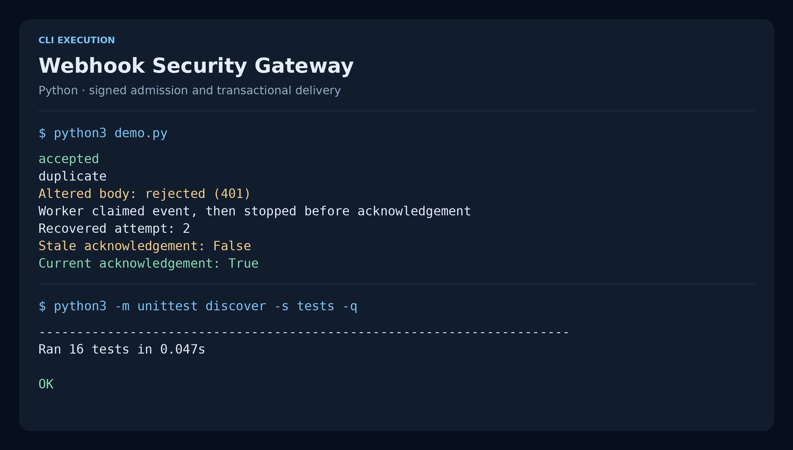

# Webhook Security Gateway

A webhook admission core that verifies the original bytes, binds the event
identifier to its signature, and commits the receipt and delivery queue in one
SQLite transaction. A worker that stops before acknowledgement leaves an event
that can be claimed again after its lease expires.

## Execution capture



Rendered from actual demo and test output. The [raw transcript](docs/assets/execution.json)
and [capture script](../../../tools/project-screenshots/README.md) make this image reproducible.

## Run

Python 3.11+ and the standard library only.

```bash
python3 -m unittest discover -s tests -v
python3 demo.py
```

The demo prints `accepted`, then `duplicate`, rejects a modified body, and
recovers an event after a simulated worker stop. Every fixture stays in a
temporary directory. Signing keys are created at runtime and never printed.

## Signature contract

Admission accepts a dictionary containing four normalized header fields:
`key_id`, `event_id`, `timestamp`, and `signature`. A transport adapter maps its
HTTP headers to these names and rejects duplicated HTTP header values.

The signature is lowercase hexadecimal HMAC-SHA-256 over the ASCII prefix below
followed immediately by the exact request body bytes:

```text
webhook-v1\n{key_id}\n{timestamp}\n{event_id}\n{body bytes}
```

Identifiers contain 1–128 ASCII letters, digits, underscores, periods, colons or
hyphens. Timestamp is canonical decimal Unix seconds. The default clock tolerance
is 300 seconds in either direction. Verify before JSON parsing; do not reserialize
JSON to check a sender signature. The default maximum body is 64 KiB.

Payload shape is `{"type":"payment.settled","data":{"invoice":"inv-42"}}`.
Duplicate JSON keys, non-finite JSON numbers, invalid UTF-8, unknown top-level
fields and a non-object `data` value are rejected. Business-specific validation
belongs to the event consumer.

## Delivery guarantees

| Boundary | Behavior |
|---|---|
| Admission | Constant-time signature comparison, configured producer identity and timestamp check |
| Duplicate event | Same producer, event id and original body digest returns the existing receipt |
| Conflicting event | Same producer and event id with different bytes returns a 409-style rejection |
| Key rotation | Old and new key ids map to one producer; re-signing cannot create a second business event |
| Database commit | Inbox receipt and outbox entry succeed together or both roll back |
| Worker claim | Immediate transaction and expiring lease prevent simultaneous claims |
| Worker recovery | Expired lease permits redelivery with a new token and incremented attempt count |
| Acknowledgement | Only the current lease token can complete the event |

Consumers must also deduplicate on `(producer, event_id)`: delivery is **at least
once**, because a worker can complete its external side effect and stop before
acknowledgement. The project does not claim exactly-once external effects.

## Integration example

```python
import secrets
from pathlib import Path
from gateway import Gateway, SigningKey

gateway = Gateway(Path("events.sqlite"), {
    "payments-2026-10": SigningKey("payments", secrets.token_bytes(32)),
})
# Provision the same key to the trusted producer through your secret manager.
# receipt = gateway.accept(normalized_headers, original_body)
```

Keep the database and its WAL files in a private directory; outbox payloads are
stored in plaintext. Load persistent secrets from a secret manager in an actual
deployment. Retain the old key for an explicit overlap period, then remove it.
Receipts persist across restarts; no automatic retention or deletion is configured.

## Validation and scope

Sixteen tests cover modified signatures, replay windows, key rotation and
revocation, JSON ambiguity, concurrent duplicates, transactional rollback,
producer isolation, worker leases and restart behavior. All run against real
SQLite files rather than mocked database operations.

This module has no public HTTP listener or outbound delivery client. TLS,
request-rate limits, clock monitoring, poison-event handling, retention,
encrypted storage and deployment-level authentication are integration concerns.
