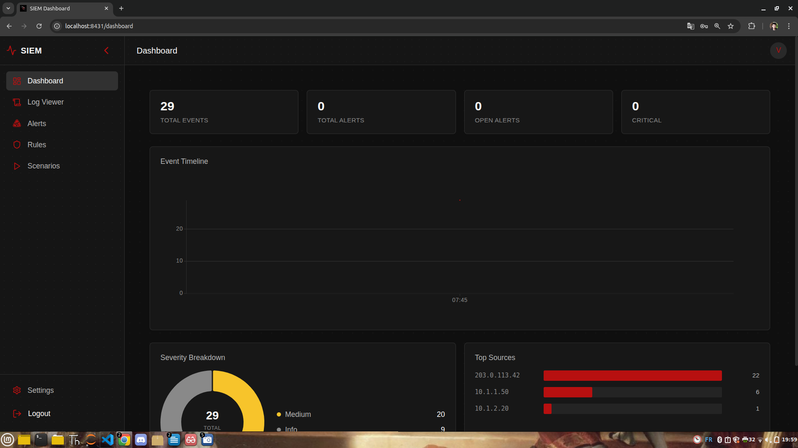

<p align="center">
  <p>Cybersecurity Projects</p>
</p>

```ruby
███████╗██╗███████╗███╗   ███╗
██╔════╝██║██╔════╝████╗ ████║
███████╗██║█████╗  ██╔████╔██║
╚════██║██║██╔══╝  ██║╚██╔╝██║
███████║██║███████╗██║ ╚═╝ ██║
╚══════╝╚═╝╚══════╝╚═╝     ╚═╝
```

[](https://github.com/Vincent-P-essy/Cybersecurity-Projects/tree/main/PROJECTS/intermediate/siem-dashboard)
[](https://www.python.org)
[](https://react.dev)
[](https://www.gnu.org/licenses/agpl-3.0)
[](https://siem.Vincent-P-essy.com/)
[](https://www.docker.com)

> Full-stack SIEM dashboard with real-time log correlation, three rule types, and a MITRE ATT&CK attack simulation engine. Live demo available.

*Security theory, architecture deep-dive, and implementation walkthrough are in the [learn modules](#learn).*

## Features

- **Real-time log ingestion** via Redis Streams with Server-Sent Events push to the browser
- **3 rule types:** Threshold (count-based), Sequence (ordered events), Aggregation (multi-field grouping)
- **4 MITRE ATT&CK playbooks** — brute force, DNS tunneling, phishing, privilege escalation
- **Attack simulation engine** — generates realistic multi-stage event chains for testing rules
- **Alert lifecycle** — acknowledge → investigate → resolve → false positive with audit trail
- **Filterable, paginated log viewer** with per-field drill-down

## Preview



## Demo

Live instance: **[siem.Vincent-P-essy.com](https://siem.Vincent-P-essy.com/)**

Or run locally:

```bash
docker compose up -d
# → http://localhost:8431
```

> [!TIP]
> Uses [`just`](https://github.com/casey/just) — run `just` to list all commands.
> Install: `curl -sSf https://just.systems/install.sh | bash -s -- --to ~/.local/bin`

## Correlation Rules

```yaml
# Example: SSH brute force detection (Threshold rule)
id: ssh-brute-force
type: threshold
condition:
  event_type: auth_failure
  service: ssh
threshold: 5
window_seconds: 60
severity: high
mitre: T1110
```

## Architecture

```
Log sources → Redis Streams
                  ↓
         Correlation Engine
         ┌────────────────────┐
         │  Threshold rules   │
         │  Sequence rules    │
         │  Aggregation rules │
         └────────────────────┘
                  ↓ alert
            MongoDB (events + alerts)
                  ↓
         Flask SSE /api/stream
                  ↓
           React Dashboard
```

## Stack

**Backend:** Flask, MongoEngine, Redis Streams, Pydantic, Argon2, JWT, Gunicorn

**Frontend:** React 19, TypeScript, Vite, TanStack Query, Zustand, visx, SCSS Modules

**Data:** MongoDB 8, Redis 7

## Learn

| Module | Topic |
|--------|-------|
| [00 - Overview](learn/00-OVERVIEW.md) | Prerequisites and quick start |
| [01 - Concepts](learn/01-CONCEPTS.md) | SIEM theory and real-world breaches |
| [02 - Architecture](learn/02-ARCHITECTURE.md) | System design and data flow |
| [03 - Implementation](learn/03-IMPLEMENTATION.md) | Code walkthrough |
| [04 - Challenges](learn/04-CHALLENGES.md) | Extension ideas and exercises |

## License

AGPL 3.0
